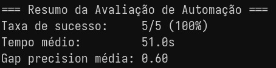

# JobPath: Agente de Trilha de Carreira baseado em Vagas de Emprego

[](LICENSE)

## Objetivo

O **JobPath** é uma prova de conceito (PoC) open source de um sistema agêntico que ajuda estudantes e profissionais a identificar **trilhas de conhecimento e habilidades** necessárias para diferentes profissões.

O sistema utiliza dados públicos de vagas de emprego (LinkedIn/Kaggle) e, via agentes LangChain + LangGraph, **indexa requisitos, gera Q&A com citações**, e cria **trilhas de estudo personalizadas** para cada tipo de carreira.

O projeto tem apelo social ao **orientar pessoas em transição de carreira ou capacitação profissional**, facilitando acesso à informação de forma estruturada e confiável.

---

## Funcionalidades

1. **Indexação de Documentos**
   - Base de dados: vagas públicas do LinkedIn via Kaggle (`arshkon/linkedin-job-postings`).
   - Indexa título, descrição e skills das vagas com embeddings semânticos (FAISS).

2. **Sistema Agêntico (LangChain + LangGraph)**
   - **Supervisor Agent**: classifica a intenção (Q&A, automação ou recusa).
   - **Retriever Agent**: busca semântica no índice FAISS com reranking por similaridade.
   - **Safety/Policy Agent**: adiciona disclaimers e filtra aconselhamentos de risco.
   - **Answerer/Writer Agent**: responde com citações obrigatórias no formato `[n]`.
   - **Self-Check Agent**: valida se as afirmações têm suporte nas evidências; re-busca 1x ou recusa.

3. **Automação**
   - **Skill Gap Analyzer**: compara perfil do usuário com requisitos extraídos via MCP + RAG.
   - **Learning Path Generator**: gera trilha de estudos priorizada por fase, duração e recursos.

4. **MCP (Model Context Protocol)**
   - Servidor MCP próprio (`mcp-jobs`) expõe o corpus de vagas como ferramenta padronizada.
   - Integrado ao `skill_gap_analyzer` via `langchain-mcp-adapters`.
   - Ferramentas expostas: `search_jobs`, `get_job_requirements`.

5. **UI**
   - Interface via **Streamlit** com duas abas:
     - **Pesquisar Vagas**: Q&A com citações e disclaimer.
     - **Trilha de Estudos**: gap analysis + plano de estudo personalizado.

---

## Stack Técnico

| Componente      | Tecnologia                                      |
| --------------- | ----------------------------------------------- |
| Linguagem       | Python 3.11+                                    |
| Agentes         | LangChain + LangGraph                           |
| RAG / Indexação | FAISS (local, open-source)                      |
| LLM             | Gemini 2.5 Flash (API)                          |
| Embeddings      | HuggingFace `bge-small-en-v1.5`                 |
| UI              | Streamlit                                       |
| MCP             | Servidor próprio (`src/mcp/server.py`)          |
| Dataset         | LinkedIn Job Postings (Kaggle, licença pública) |
| Containerização | Docker + Docker Compose                         |

---

## Arquitetura

```text
[Usuário - Streamlit UI]
         ↓
[Supervisor Agent] → classifica intenção
    ├─> Q&A
    │     ↓
    │  [Retriever Agent] → FAISS similarity search
    │     ↓
    │  [Answerer Agent] → resposta com citações [1][2]
    │     ↓
    │  [Self-Check Agent] → valida evidências
    │     ├─> aprovado → [Safety Agent] → resposta final
    │     └─> reprovado → re-busca (1x) ou recusa
    │
    └─> Automação
          ↓
       [Skill Gap Analyzer] ← MCP Server (search_jobs)
          ↓
       [Learning Path Generator] → trilha por fases
          ↓
       Resultado final com disclaimer
```

---

## Segurança do MCP

O servidor MCP (`src/mcp/server.py`) segue os seguintes controles:

| Controle                      | Implementação                                                                                             |
| ----------------------------- | --------------------------------------------------------------------------------------------------------- |
| Allowlist de ferramentas      | Apenas `search_jobs` e `get_job_requirements` são permitidas                                              |
| Acesso a arquivos             | Restrito ao índice FAISS em `data/faiss_index/` (somente leitura)                                         |
| Log de chamadas               | Toda chamada é registrada em `logs/mcp_calls.log` com timestamp e argumentos                              |
| O que o agente NÃO pode fazer | Escrever arquivos, acessar variáveis de ambiente, executar comandos do sistema, acessar outros diretórios |

**Riscos conhecidos e mitigações:**

- **Supply-chain**: o servidor MCP é próprio (não de terceiros), eliminando risco de exfiltração por código malicioso externo.
- **Prompt injection via documentos**: os documentos indexados são apenas vagas públicas do LinkedIn, sem conteúdo executável.
- **Exposição de dados**: o corpus contém apenas dados públicos — nenhum dado pessoal é indexado.

---

## Como Executar

### Pré-requisitos

- Docker e Docker Compose instalados
- Chave de API do Google Gemini (com billing ativo)
- Credenciais do Kaggle

### Configuração

```bash
# 1. Clone o repositório
git clone https://github.com/seu-usuario/jobpath.git
cd jobpath

# 2. Crie o arquivo .env
echo "GOOGLE_API_KEY=sua_chave" >> .env
echo "KAGGLE_USERNAME=seu_usuario" >> .env
echo "KAGGLE_KEY=sua_chave_kaggle" >> .env

# 3. (Opcional) Gere o índice FAISS no Google Colab para evitar uso de CPU local
# Veja: notebooks/gerar_indice.ipynb

# 4. Suba o projeto
docker compose up --build
```

Acesse em **http://localhost:8501**

---

## Avaliação

### RAG (RAGAS)

Executar com:

```bash
docker compose exec career-guide python eval/qa_eval.py
```

| Métrica           | Descrição                                          |
| ----------------- | -------------------------------------------------- |
| Faithfulness      | Afirmações suportadas pelos documentos recuperados |
| Answer Relevancy  | Relevância da resposta para a pergunta             |
| Context Precision | Precisão dos chunks recuperados                    |
| Context Recall    | Cobertura dos chunks relevantes                    |
| Latência          | Tempo médio de resposta por pergunta (segundos)    |

### Perguntas rotuladas (RAG)

| #   | Pergunta                                                  | Ground Truth                                                                                     |
| --- | --------------------------------------------------------- | ------------------------------------------------------------------------------------------------ |
| 1   | Quais skills são exigidas para Data Scientist?            | Python, machine learning, SQL e estatística são as skills mais comuns para Data Scientist.       |
| 2   | O que um Backend Developer precisa saber?                 | Backend developers precisam de Python ou Java, APIs REST, bancos de dados e Docker.              |
| 3   | Quais são os requisitos para Product Manager?             | Product managers precisam de habilidades em Agile, roadmap, comunicação e análise de dados.      |
| 4   | O que é exigido para DevOps Engineer?                     | DevOps engineers precisam de Kubernetes, CI/CD, Terraform, Linux e cloud computing.              |
| 5   | Quais skills um UX Designer precisa ter?                  | UX Designers precisam de Figma, pesquisa com usuários, prototipação e design thinking.           |
| 6   | O que um Frontend Developer precisa saber?                | Frontend developers precisam de JavaScript, React ou Vue, HTML, CSS e responsividade.            |
| 7   | Quais são os requisitos para Machine Learning Engineer?   | ML Engineers precisam de Python, TensorFlow ou PyTorch, matemática e cloud computing.            |
| 8   | O que um Data Engineer precisa dominar?                   | Data Engineers precisam de SQL, Python, pipelines de dados, Spark e ferramentas de cloud.        |
| 9   | Quais habilidades são necessárias para Cloud Architect?   | Cloud Architects precisam de AWS ou Azure ou GCP, redes, segurança e infraestrutura como código. |
| 10  | O que um Cybersecurity Analyst precisa saber?             | Analistas de segurança precisam de redes, criptografia, análise de vulnerabilidades e SIEM.      |
| 11  | Quais skills são comuns em vagas de Full Stack Developer? | Full Stack Developers precisam de JavaScript, Node.js, React, bancos de dados e APIs REST.       |
| 12  | O que um Mobile Developer precisa dominar?                | Mobile developers precisam de Swift ou Kotlin, React Native ou Flutter e publicação em lojas.    |
| 13  | Quais são os requisitos para Business Analyst?            | Business Analysts precisam de SQL, Excel, requisitos de negócio, Power BI e comunicação.         |
| 14  | O que um Scrum Master precisa saber?                      | Scrum Masters precisam de metodologias ágeis, Scrum, facilitação e ferramentas como Jira.        |
| 15  | Quais habilidades são exigidas para Data Analyst?         | Data Analysts precisam de SQL, Excel, Python ou R, visualização de dados e estatística básica.   |

### Resultados (RAGAS)


### Automação

Executar com:

```bash
docker compose exec career-guide python eval/automation_eval.py
```

5 tarefas avaliadas (Data Scientist, Backend Developer, Product Manager, DevOps Engineer, UX Designer):

| Métrica         | Descrição                                        |
| --------------- | ------------------------------------------------ |
| Taxa de sucesso | % de trilhas geradas com gap e fases corretas    |
| Gap precision   | % de skills esperadas identificadas corretamente |
| Tempo médio     | Segundos por tarefa de automação                 |

### Tarefas de automação avaliadas

| #   | Cargo alvo        | Skills do usuário | Gap esperado                      | Fases mínimas |
| --- | ----------------- | ----------------- | --------------------------------- | ------------- |
| 1   | Data Scientist    | Python, Excel     | Machine Learning, SQL, Statistics | 2             |
| 2   | Backend Developer | HTML, CSS         | Python, API, Docker               | 2             |
| 3   | Product Manager   | Excel, PowerPoint | Agile, Roadmap                    | 1             |
| 4   | DevOps Engineer   | Linux, Python     | Kubernetes, CI/CD, Terraform      | 2             |
| 5   | UX Designer       | Photoshop         | Figma, User Research              | 1             |

### Resultados (Automação)



### MCP

| Item                 | Descrição                                              |
| -------------------- | ------------------------------------------------------ |
| Ferramentas expostas | `search_jobs`, `get_job_requirements`                  |
| Allowlist            | Apenas essas 2 ferramentas são permitidas              |
| Logs                 | `logs/mcp_calls.log` — timestamp, tool, argumentos     |
| Limites              | Somente leitura, restrito a `data/faiss_index/`        |
| O agente não pode    | Escrever, executar comandos, acessar outros diretórios |

---

## Limitações e Próximos Passos

- Dataset em inglês — respostas e trilhas em inglês/misto
- Sem GPU local — embeddings gerados via Google Colab
- LLM via API — dependência de conectividade e billing
- Próximos passos: reranking, suporte a português, avaliação automática contínua

---

## Licença

MIT License — veja [LICENSE](LICENSE)

## Citação

Veja [CITATION.cff](CITATION.cff)
